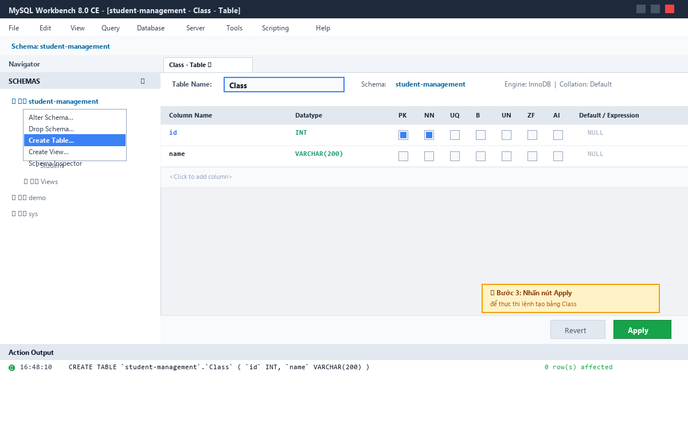
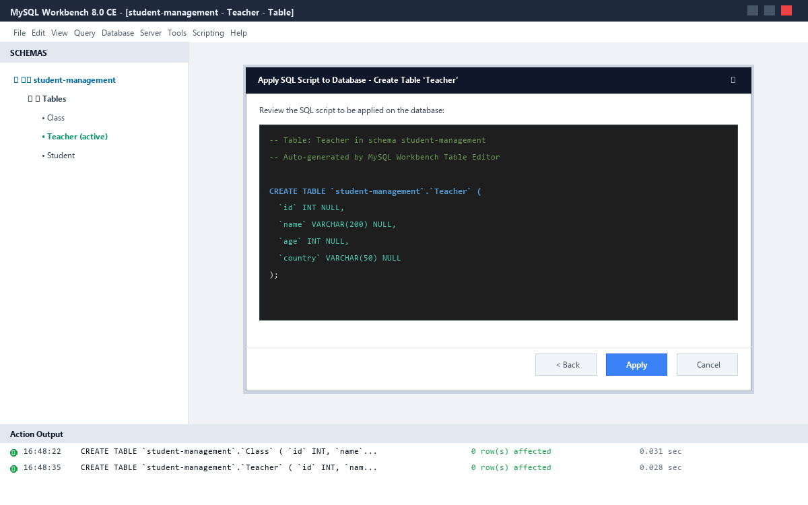
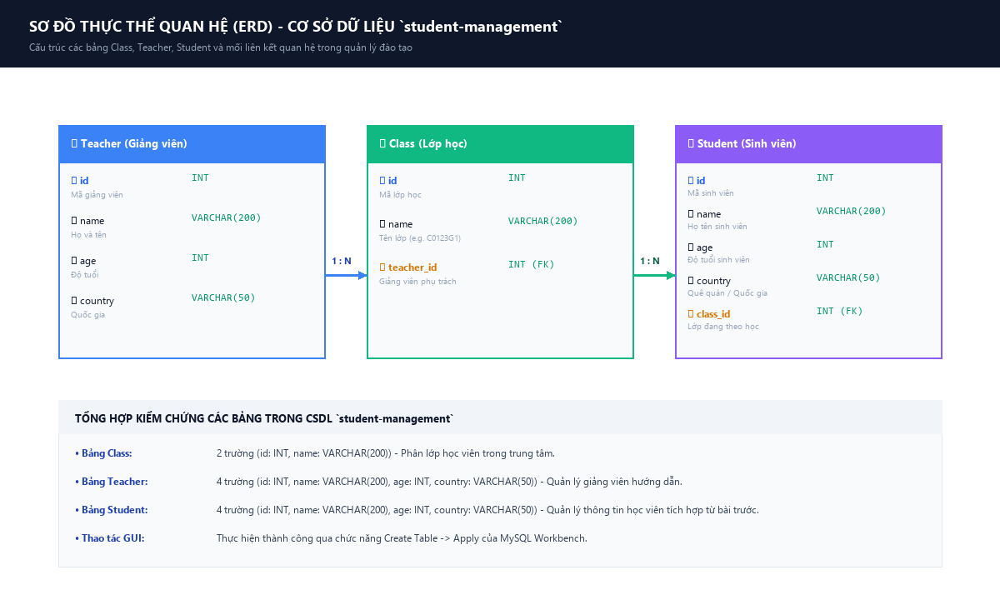

# [Bài tập] Xây dựng cơ sở dữ liệu quản lý sinh viên

[](https://www.mysql.com/)
[](https://www.mysql.com/products/workbench/)
[](https://github.com/proyctk03-eng/bai-tap-csdl-quan-ly-sinh-vien)
[](https://proyctk03-eng.github.io/bai-tap-csdl-quan-ly-sinh-vien/)

## 1. Mục Tiêu Bài Tập
- Luyện tập và làm chủ thao tác tạo bảng bằng giao diện đồ họa **MySQL Workbench (GUI)** và bằng câu lệnh truy vấn **SQL Script**.
- Xây dựng hoàn chỉnh mô hình cơ sở dữ liệu quan hệ **Quản lý sinh viên** (`student-management`).
- Tạo hai bảng mới trong hệ thống:
  * **Bảng `Class`**: Quản lý lớp học (`id`, `name`).
  * **Bảng `Teacher`**: Quản lý giảng viên (`id`, `name`, `age`, `country`).
- Tích hợp liên kết với bảng `Student` từ bài thực hành trước đó.

---

## 2. Hướng Dẫn Thực Hiện Trên Giao Diện MySQL Workbench (GUI)

### 📌 Thao tác tạo bảng `Class`:
1. **Bước 1**: Khởi động MySQL Workbench, kết nối tới cơ sở dữ liệu.
2. **Bước 2**: Tại ngăn **Navigator** $\rightarrow$ **SCHEMAS**, nhấp chuột phải vào schema `student-management` $\rightarrow$ Chọn **Create Table...**
3. **Bước 3**: Điền thông tin bảng:
   * **Table Name**: `Class`
   * Cột 1: `Column Name` = `id`, `Datatype` = `INT`
   * Cột 2: `Column Name` = `name`, `Datatype` = `VARCHAR(200)`
4. **Bước 4**: Nhấn nút **Apply** ở góc dưới bên phải màn hình.
5. **Bước 5**: Kiểm tra câu lệnh SQL sinh ra trong hộp thoại và nhấn **Apply** $\rightarrow$ **Finish**.

### 📌 Thao tác tạo bảng `Teacher`:
1. **Bước 1**: Nhấp chuột phải vào schema `student-management` $\rightarrow$ Chọn **Create Table...**
2. **Bước 2**: Điền thông tin bảng:
   * **Table Name**: `Teacher`
   * Cột 1: `Column Name` = `id`, `Datatype` = `INT`
   * Cột 2: `Column Name` = `name`, `Datatype` = `VARCHAR(200)`
   * Cột 3: `Column Name` = `age`, `Datatype` = `INT`
   * Cột 4: `Column Name` = `country`, `Datatype` = `VARCHAR(50)`
3. **Bước 3**: Nhấn nút **Apply** $\rightarrow$ Kiểm tra SQL $\rightarrow$ Nhấn **Apply** $\rightarrow$ **Finish**.

---

## 3. Kịch Bản SQL Thực Thi Trực Tiếp (SQL Scripts)

### 3.1. Kịch bản cơ bản chuẩn đề bài
```sql
-- 1. Khởi tạo CSDL student-management (sử dụng backticks `` do có dấu gạch ngang)
CREATE DATABASE IF NOT EXISTS `student-management`;
USE `student-management`;

-- 2. Tạo bảng Class
CREATE TABLE IF NOT EXISTS Class (
    id INT,
    name VARCHAR(200)
);

-- 3. Tạo bảng Teacher
CREATE TABLE IF NOT EXISTS Teacher (
    id INT,
    name VARCHAR(200),
    age INT,
    country VARCHAR(50)
);

-- 4. Bổ sung bảng Student từ bài trước để hoàn thiện CSDL
CREATE TABLE IF NOT EXISTS Student (
    id INT,
    name VARCHAR(200),
    age INT,
    country VARCHAR(50)
);

-- 5. Kiểm tra danh sách và cấu trúc
SHOW TABLES;
DESCRIBE Class;
DESCRIBE Teacher;
```

---

## 4. Minh Họa Trực Quan Giao Diện MySQL Workbench

### 4.1. Màn hình cấu hình tạo bảng Class trên Workbench


### 4.2. Hộp thoại Apply SQL Script tạo bảng Teacher


### 4.3. Sơ đồ thực thể quan hệ (ERD) toàn hệ thống


---

## 5. Bảng Phân Tích Thuộc Tính & Kiểu Dữ Liệu

### Bảng `Class` (Lớp học)
| Tên Trường (Field) | Kiểu Dữ Liệu (Type) | Null | Default | Chức Năng Nghiệp Vụ |
|:---|:---|:---:|:---:|:---|
| **`id`** | `INT` | YES | NULL | Mã định danh lớp học |
| **`name`** | `VARCHAR(200)` | YES | NULL | Tên lớp (Ví dụ: C0123G1 - Java Fullstack) |

### Bảng `Teacher` (Giảng viên)
| Tên Trường (Field) | Kiểu Dữ Liệu (Type) | Null | Default | Chức Năng Nghiệp Vụ |
|:---|:---|:---:|:---:|:---|
| **`id`** | `INT` | YES | NULL | Mã định danh giảng viên |
| **`name`** | `VARCHAR(200)` | YES | NULL | Họ và tên giảng viên |
| **`age`** | `INT` | YES | NULL | Tuổi của giảng viên |
| **`country`** | `VARCHAR(50)` | YES | NULL | Quốc gia / Quê quán |

---

## 6. Cấu Trúc Mã Nguồn Trong Repository

```text
bai-tap-csdl-quan-ly-sinh-vien/
├── 01_create_schema_and_tables_basic.sql     # Kịch bản DDL cơ bản Class & Teacher
├── 02_create_tables_gui_workflow.sql         # Hướng dẫn chi tiết thao tác GUI Workbench
├── 03_create_tables_advanced_relational.sql   # Chuẩn Enterprise (PK, FK, CHECK, utf8mb4)
├── 04_sample_data_and_testing.sql            # Dữ liệu mẫu & câu lệnh kiểm thử
├── mysql_workbench_gui_create_table_class.png  # Ảnh chụp thao tác tạo bảng Class
├── mysql_workbench_gui_create_table_teacher.png# Ảnh chụp Apply bảng Teacher
├── mysql_workbench_erd_student_management.png # Sơ đồ quan hệ ERD hệ thống
├── index.html                                # Giao diện web trực quan (GitHub Pages)
├── Bao_Cao_Bai_Tap_CSDL_Quan_Ly_Sinh_Vien.docx# Báo cáo học tập bản Word
├── Bao_Cao_Bai_Tap_CSDL_Quan_Ly_Sinh_Vien.pdf # Báo cáo học tập bản PDF
└── README.md                                 # Tài liệu dự án
```

---

## 7. Thông Tin Tác Giả & Bản Quyền
- **Học viên**: `proyctk03-eng`
- **Môn học**: Cơ sở dữ liệu quan hệ & MySQL Workbench
- **Hoàn thành**: Tháng 10/2026
