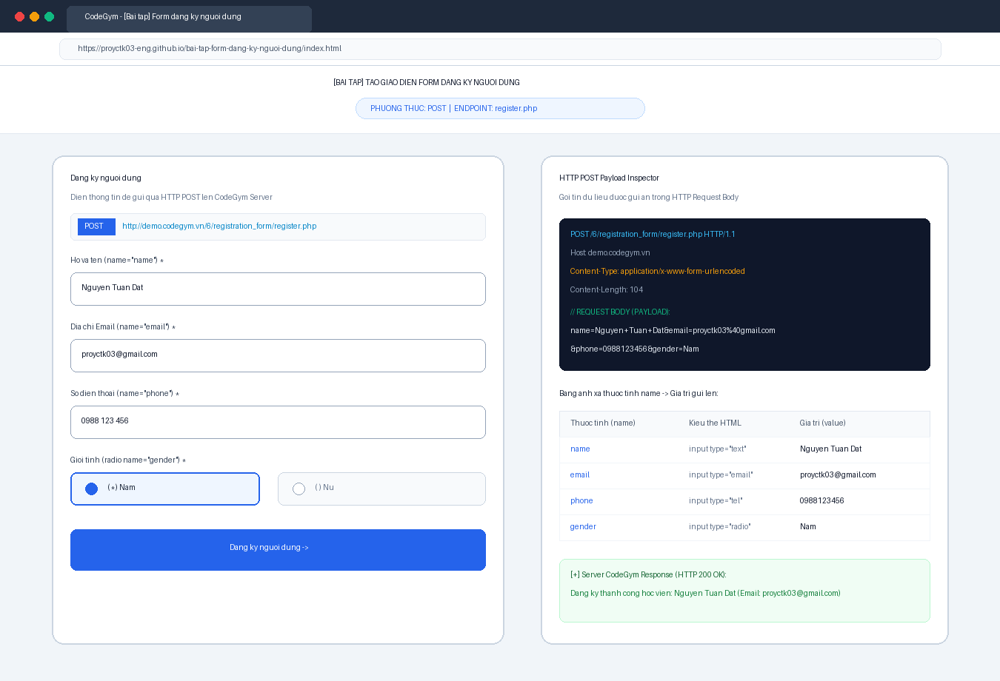
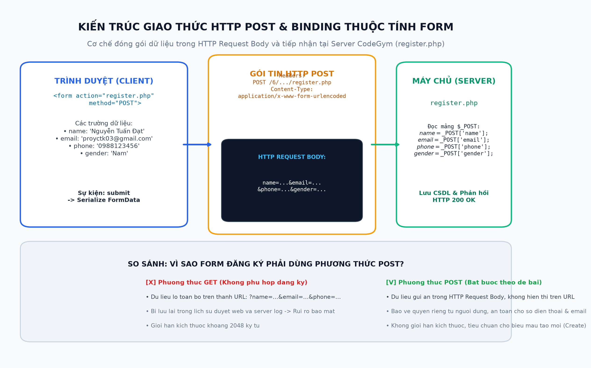
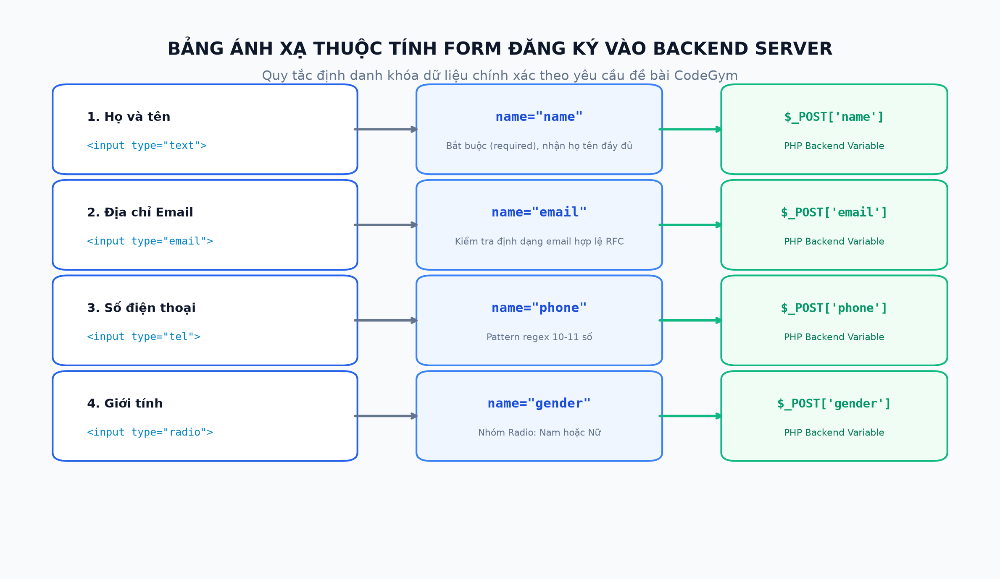

# [Bài tập] Tạo Giao Diện Form Đăng Ký Người Dùng (CodeGym Lab)

## 📌 Giới Thiệu Bài Tập
Kho lưu trữ này chứa toàn bộ mã nguồn và tài liệu kỹ thuật hoàn chỉnh cho bài tập:
**"[Bài tập] Tạo giao diện form đăng ký người dùng"** thuộc chương trình đào tạo Full-Stack Web Development tại CodeGym.

Bài tập rèn luyện kỹ năng xây dựng biểu mẫu đăng ký tài khoản với giao diện thân thiện, hiện đại và cài đặt chính xác cấu hình gửi dữ liệu qua phương thức **HTTP POST** lên endpoint máy chủ backend:
* **Server Action Endpoint:** `http://demo.codegym.vn/6/registration_form/register.php`
* **HTTP Method bắt buộc:** `POST`
* **Các trường dữ liệu (thuộc tính `name` bắt buộc):**
  * Trường "Họ và tên": `name="name"`
  * Trường "Email": `name="email"`
  * Trường "Số điện thoại": `name="phone"`
  * Trường "Giới tính": `name="gender"` (Radio button: `Nam` / `Nữ`)

---

## 🗂 Cấu Trúc Thư Mục & Các Tệp Tin

```
bai-tap-form-dang-ky-nguoi-dung/
├── index.html                                    # Giao diện chính tích hợp HTTP POST Inspector & Mock Server
├── register_basic.html                           # Phiên bản HTML thuần túy không kèm script (dành cho test chuẩn)
├── browser_register_form_screenshot.png          # Ảnh chụp màn hình kết quả chạy trên trình duyệt web
├── http_post_architecture_diagram.png           # Sơ đồ kiến trúc gói tin HTTP POST và Request Body
├── form_fields_mapping_diagram.png              # Sơ đồ ánh xạ thuộc tính name của form vào biến backend $_POST
├── build_register_report.py                      # Script tự động tạo báo cáo Word (.docx)
├── export_register_pdf.ps1                       # Script tự động xuất báo cáo PDF (.pdf)
├── Bao_Cao_Bai_Tap_Form_Dang_Ky_Nguoi_Dung.docx # Báo cáo kỹ thuật định dạng Word (.docx)
├── Bao_Cao_Bai_Tap_Form_Dang_Ky_Nguoi_Dung.pdf  # Báo cáo kỹ thuật định dạng PDF (.pdf)
└── README.md                                     # Tài liệu hướng dẫn và đặc tả kỹ thuật
```

---

## 📋 Chi Tiết Triển Khai Kỹ Thuật

### 1. Mã Nguồn HTML Form Chuẩn ([register_basic.html](./register_basic.html))
```html
<form action="http://demo.codegym.vn/6/registration_form/register.php" method="POST">
    <!-- Họ và tên: name="name" -->
    <div class="form-group">
        <label for="name">Họ và tên *</label>
        <input type="text" id="name" name="name" placeholder="Nguyễn Văn An" required />
    </div>

    <!-- Email: name="email" -->
    <div class="form-group">
        <label for="email">Địa chỉ Email *</label>
        <input type="email" id="email" name="email" placeholder="an.nguyen@domain.com" required />
    </div>

    <!-- Số điện thoại: name="phone" -->
    <div class="form-group">
        <label for="phone">Số điện thoại *</label>
        <input type="tel" id="phone" name="phone" placeholder="0912345678" pattern="[0-9]{10,11}" required />
    </div>

    <!-- Giới tính: name="gender" -->
    <div class="form-group">
        <label>Giới tính *</label>
        <label><input type="radio" name="gender" value="Nam" checked required> Nam</label>
        <label><input type="radio" name="gender" value="Nữ" required> Nữ</label>
    </div>

    <!-- Nút Đăng ký (Submit) -->
    <button type="submit" class="btn-submit">Đăng ký</button>
</form>
```

---

## 📊 Bảng Đối Soát Quy Chuẩn Tham Số

| Tên trường trên UI | Thuộc tính `name` | Kiểu thẻ HTML | Ràng buộc dữ liệu | Biến đọc tại Backend PHP |
| :--- | :--- | :--- | :--- | :--- |
| **Họ và tên** | `name` | `<input type="text">` | `required` (Bắt buộc) | `$_POST['name']` |
| **Địa chỉ Email** | `email` | `<input type="email">` | `required`, validate email RFC | `$_POST['email']` |
| **Số điện thoại** | `phone` | `<input type="tel">` | `required`, `pattern="[0-9]{10,11}"` | `$_POST['phone']` |
| **Giới tính** | `gender` | `<input type="radio">` | Radio group: `Nam` hoặc `Nữ` | `$_POST['gender']` |
| **Nút Submit** | *(N/A)* | `<button type="submit">` | Submit toàn bộ HTTP Request Body | N/A |

---

## 💡 Vì Sao Biểu Mẫu Đăng Ký Bắt Buộc Dùng POST?
1. **Bảo mật & Quyền riêng tư:** Dữ liệu thông tin cá nhân (họ tên, email, số điện thoại) được đóng gói ẩn trong **HTTP Request Body** (`application/x-www-form-urlencoded`), không bị lộ trên thanh địa chỉ URL hoặc lưu trong lịch sử duyệt web như phương thức GET.
2. **Khả năng mở rộng:** Không bị giới hạn độ dài ký tự như GET (~2048 ký tự), cho phép gửi nhiều trường dữ liệu phức tạp.
3. **Tuân thủ chuẩn REST / HTTP Semantics:** Các thao tác tạo mới tài nguyên trên máy chủ (Create/Register) luôn sử dụng phương thức POST.

---

## 🖼 Minh Chứng Trực Quan

### 1. Kết Quả Hiển Thị Trên Trình Duyệt Web


### 2. Sơ Đồ Kiến Trúc Gói Tin HTTP POST


### 3. Sơ Đồ Ánh Xạ Thuộc Tính Name Vào Backend


---

## 🚀 Hướng Dẫn Chạy & Kiểm Thử
1. Mở trực tiếp tệp `index.html` hoặc `register_basic.html` bằng Google Chrome, Firefox, Safari hoặc Edge.
2. Tại `index.html`, bạn có thể chuyển đổi linh hoạt:
   * **Chế độ kiểm thử (Live Inspector):** Bấm "Đăng ký" để xem trước chính xác gói tin HTTP POST Payload và phản hồi mẫu giả lập mà không bị gián đoạn khi máy chủ CodeGym demo offline.
   * **Gửi trực tiếp Server CodeGym (Live POST):** Submit trực tiếp lên endpoint `http://demo.codegym.vn/6/registration_form/register.php`.

---
*Tác giả: Nguyễn Tuấn Đạt (proyctk03-eng)*  
*Khóa học: CodeGym FullStack Track*
