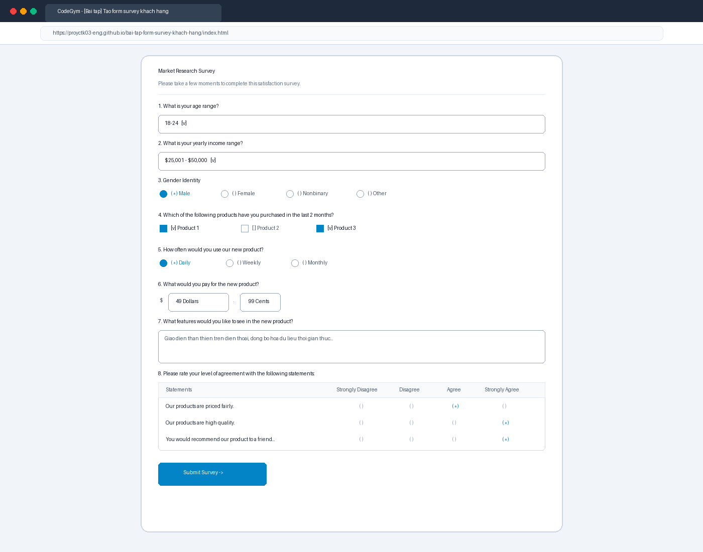
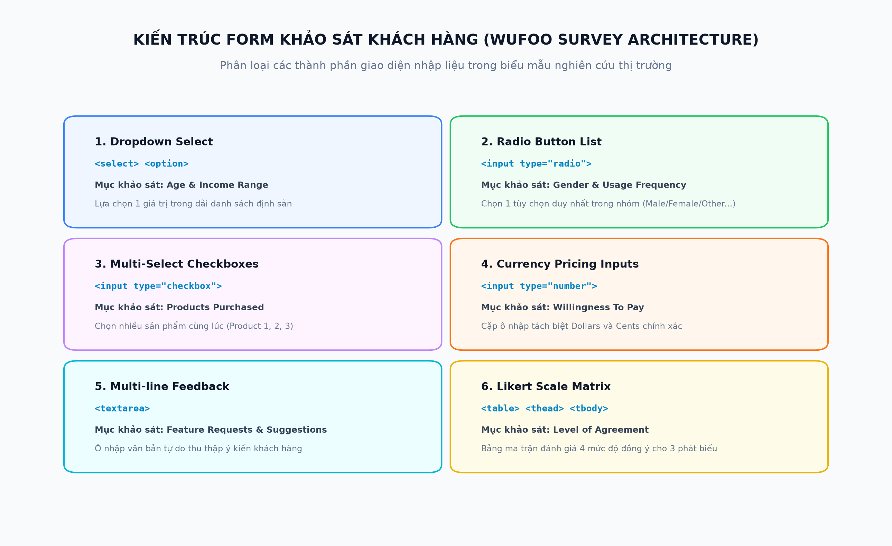
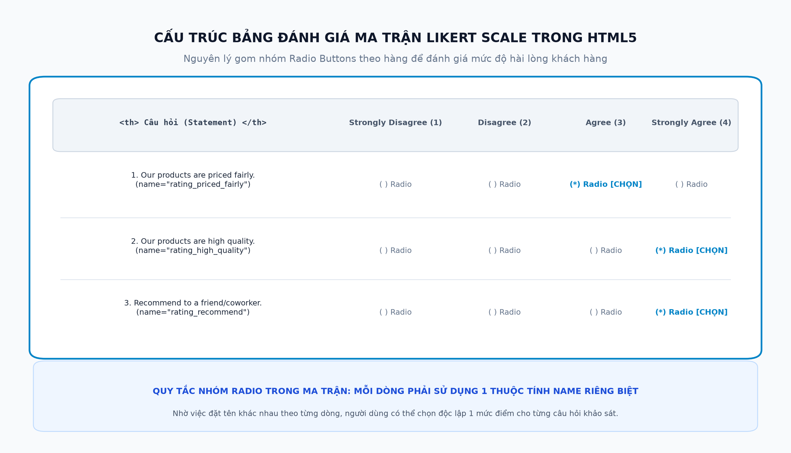

# [Bài tập] Tạo Form Lấy Survey Khách Hàng (Wufoo Market Research Survey)

## 📌 Giới Thiệu Bài Tập
Kho lưu trữ này chứa toàn bộ mã nguồn và tài liệu kỹ thuật hoàn chỉnh cho bài tập:
**"[Bài tập] Tạo form lấy survey khách hàng"** thuộc chương trình đào tạo Full-Stack Web Development tại CodeGym.

Bài tập mô phỏng và tái hiện hoàn chỉnh biểu mẫu nghiên cứu thị trường (Market Research Survey) từ mẫu biểu Wufoo tiêu chuẩn:
[Wufoo Survey Embed Template](https://gallery.wufoo.com/embed/pyej3161l9pt0d/def/embedKey=pyej3161l9pt0d89279)

---

## 🗂 Cấu Trúc Thư Mục & Các Tệp Tin

```
bai-tap-form-survey-khach-hang/
├── index.html                                   # Giao diện khảo sát cao cấp tích hợp Modal JSON phản hồi kết quả
├── survey_basic.html                            # Mã nguồn biểu mẫu HTML5 cơ bản thuần túy chuẩn Wufoo
├── browser_survey_result_screenshot.png         # Ảnh chụp màn hình kết quả chạy trên trình duyệt web
├── survey_form_architecture_diagram.png         # Sơ đồ kiến trúc các loại Input trong form khảo sát
├── likert_matrix_structure_diagram.png          # Sơ đồ nguyên lý nhóm Radio trong bảng Likert Scale Matrix
├── build_survey_report.py                       # Script tự động tạo báo cáo Word (.docx)
├── export_survey_pdf.ps1                        # Script tự động xuất báo cáo PDF (.pdf)
├── Bao_Cao_Bai_Tap_Form_Survey_Khach_Hang.docx # Báo cáo kỹ thuật định dạng Word (.docx)
├── Bao_Cao_Bai_Tap_Form_Survey_Khach_Hang.pdf  # Báo cáo kỹ thuật định dạng PDF (.pdf)
└── README.md                                    # Tài liệu hướng dẫn và đặc tả kỹ thuật
```

---

## 📋 Chi Tiết 8 Nhóm Câu Hỏi Khảo Sát

| STT | Câu hỏi khảo sát | Kiểu thẻ HTML | Các tùy chọn dữ liệu |
| :--- | :--- | :--- | :--- |
| **1** | What is your age range? | `<select> <option>` | `18-24`, `25-34`, `35-50`, `50+` |
| **2** | What is your yearly income range? | `<select> <option>` | `$0 - $25,000`, `$25,001 - $50,000`, `$50,001 - $100,000`, `$100,000+` |
| **3** | Gender Identity | `<input type="radio">` | `Male`, `Female`, `Nonbinary`, `Other` (kèm ô nhập text) |
| **4** | Which products have you purchased? | `<input type="checkbox">` | `Product 1`, `Product 2`, `Product 3` (chọn nhiều) |
| **5** | How often would you use our new product? | `<input type="radio">` | `Daily`, `Weekly`, `Monthly` |
| **6** | What would you pay for the new product? | `<input type="number">` | Tách riêng ô `Dollars` ($) và `Cents` (.) |
| **7** | What features would you like to see? | `<textarea>` | Văn bản đa dòng đóng góp ý kiến tính năng |
| **8** | Please rate your level of agreement... | `<table> + Radio` | Bảng ma trận thang đo Likert Scale 4 mức độ |

---

## 💡 Kỹ Thuật Bảng Ma Trận Đánh Giá Likert Scale
* **Cấu trúc bảng HTML:** Sử dụng các thẻ `<table>`, `<thead>`, `<tbody>`, `<tr>`, `<th>`, `<td>`.
* **Gom nhóm Radio theo hàng:** Mỗi phát biểu (Statement) sử dụng một thuộc tính `name` riêng biệt (ví dụ: `rating_priced_fairly`, `rating_high_quality`, `rating_recommend`).
* **Các mức độ đo lường:** `Strongly Disagree` (1), `Disagree` (2), `Agree` (3), `Strongly Agree` (4).

---

## 🖼 Minh Chứng Trực Quan

### 1. Kết Quả Hiển Thị Trên Trình Duyệt Web


### 2. Sơ Đồ Kiến Trúc Form Khảo Sát


### 3. Sơ Đồ Cấu Trúc Ma Trận Likert Scale


---

## 🚀 Hướng Dẫn Chạy & Kiểm Thử
1. Mở trực tiếp tệp `index.html` hoặc `survey_basic.html` bằng bất kỳ trình duyệt web nào.
2. Điền thông tin vào các trường khảo sát và bấm nút **Submit Survey**.
3. Cửa sổ Modal sẽ tự động hiển thị cấu trúc dữ liệu JSON đã thu thập.

---
*Tác giả: Nguyễn Tuấn Đạt (proyctk03-eng)*  
*Khóa học: CodeGym FullStack Track*
