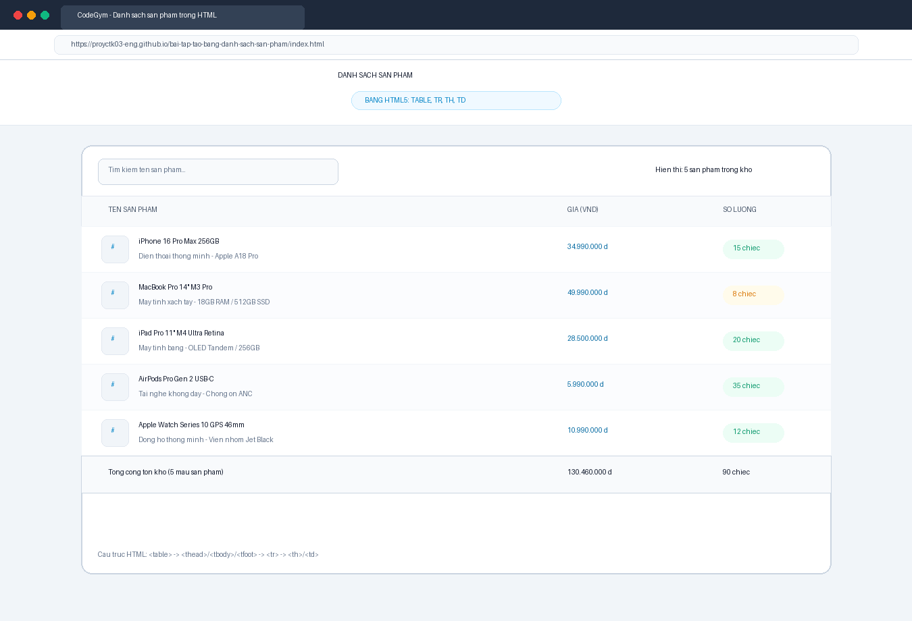
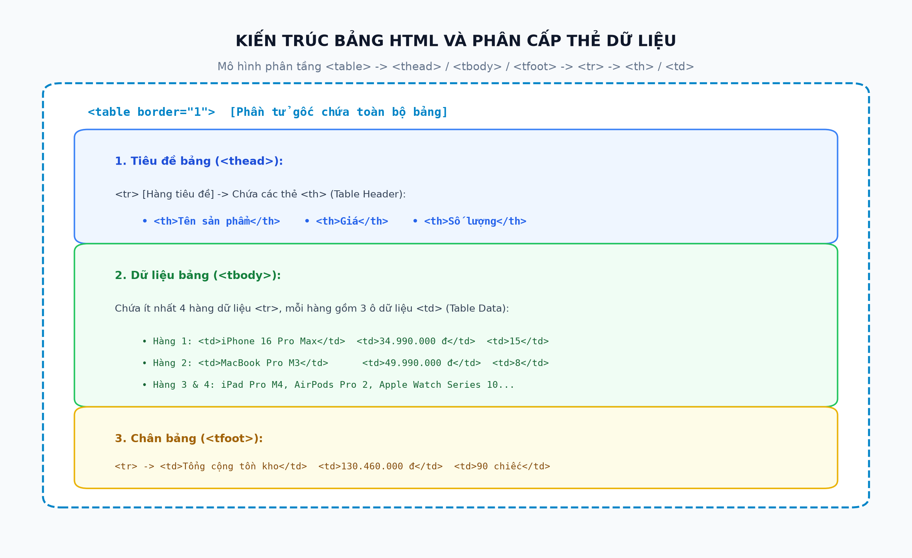

# [Bài tập] Tạo Bảng Danh Sách Sản Phẩm Trong HTML (CodeGym Lab)

## 📌 Giới Thiệu Bài Tập
Kho lưu trữ này chứa bài làm hoàn chỉnh cho nội dung:
**"[Bài tập] Tạo bảng danh sách sản phẩm trong HTML"** thuộc chương trình đào tạo Full-Stack Web Development tại CodeGym.

Mục tiêu bài tập:
* Luyện tập sử dụng cấu trúc bảng HTML với các thẻ `<table>`, `<tr>`, `<th>`, `<td>` để hiển thị dữ liệu sản phẩm có cấu trúc.
* Tạo tệp `index.html` với tiêu đề `<h1>Danh sách sản phẩm</h1>`.
* Xây dựng bảng gồm 3 cột: **Tên sản phẩm**, **Giá**, **Số lượng**.
* Bổ sung tối thiểu 4 sản phẩm công nghệ thực tế (bài làm triển khai 5 sản phẩm cao cấp).

---

## 🗂 Cấu Trúc Thư Mục & Các Tệp Tin

```
bai-tap-tao-bang-danh-sach-san-pham/
├── index.html                                        # Tệp chính theo yêu cầu, giao diện bảng hiện đại kèm Live Search
├── index_basic.html                                  # Phiên bản HTML thuần túy tối giản không kèm CSS
├── browser_product_table_screenshot.png              # Ảnh chụp màn hình kết quả chạy trên trình duyệt web
├── html_table_product_structure.png                 # Sơ đồ kiến trúc cấu trúc thẻ bảng HTML
├── build_product_report.py                           # Script tự động xuất báo cáo Word (.docx)
├── export_product_pdf.ps1                            # Script tự động xuất báo cáo PDF (.pdf)
├── Bao_Cao_Bai_Tap_Tao_Bang_Danh_Sach_San_Pham.docx # Báo cáo kỹ thuật định dạng Word (.docx)
├── Bao_Cao_Bai_Tap_Tao_Bang_Danh_Sach_San_Pham.pdf  # Báo cáo kỹ thuật định dạng PDF (.pdf)
└── README.md                                         # Tài liệu hướng dẫn và đặc tả kỹ thuật
```

---

## 📋 Chi Tiết Triển Khai Kỹ Thuật

### 1. Mã Nguồn HTML Chuẩn Theo Đề Bài ([index_basic.html](./index_basic.html))
```html
<!DOCTYPE html>
<html lang="vi">
<head>
    <meta charset="utf-8">
    <title>Danh sách sản phẩm</title>
</head>
<body>

    <h1>Danh sách sản phẩm</h1>

    <table border="1" cellpadding="8" cellspacing="0">
        <tr>
            <th>Tên sản phẩm</th>
            <th>Giá</th>
            <th>Số lượng</th>
        </tr>
        <tr>
            <td>iPhone 16 Pro Max</td>
            <td>34.990.000 đ</td>
            <td>15</td>
        </tr>
        <tr>
            <td>MacBook Pro M3</td>
            <td>49.990.000 đ</td>
            <td>8</td>
        </tr>
        <tr>
            <td>iPad Pro M4</td>
            <td>28.500.000 đ</td>
            <td>20</td>
        </tr>
        <tr>
            <td>AirPods Pro 2</td>
            <td>5.990.000 đ</td>
            <td>35</td>
        </tr>
        <tr>
            <td>Apple Watch Series 10</td>
            <td>10.990.000 đ</td>
            <td>12</td>
        </tr>
    </table>

</body>
</html>
```

---

## 📊 Bảng Dữ Liệu Sản Phẩm Mẫu

| STT | Tên sản phẩm | Giá | Số lượng | Ghi chú trạng thái |
| :---: | :--- | :---: | :---: | :---: |
| **1** | iPhone 16 Pro Max 256GB | 34.990.000 đ | 15 | Còn hàng |
| **2** | MacBook Pro 14" M3 Pro | 49.990.000 đ | 8 | Sắp hết hàng |
| **3** | iPad Pro 11" M4 Ultra Retina | 28.500.000 đ | 20 | Còn hàng |
| **4** | AirPods Pro Gen 2 USB-C | 5.990.000 đ | 35 | Còn hàng |
| **5** | Apple Watch Series 10 GPS | 10.990.000 đ | 12 | Còn hàng |
| **Tổng** | **Tổng tồn kho (5 mẫu sản phẩm)** | **130.460.000 đ** | **90 chiếc** | **Đầy đủ danh mục** |

---

## 💡 Phân Tích Kiến Trúc Thẻ Bảng HTML
* `<table>`: Phần tử gốc định nghĩa bảng.
* `<tr>` (Table Row): Tạo một hàng mới trong bảng.
* `<th>` (Table Header): Ô tiêu đề cột (in đậm, căn giữa/trái mặc định): `Tên sản phẩm`, `Giá`, `Số lượng`.
* `<td>` (Table Data): Ô dữ liệu chứa thông tin chi tiết của từng sản phẩm.

---

## 🖼 Minh Chứng Trực Quan

### 1. Kết Quả Hiển Thị Trên Trình Duyệt Web


### 2. Sơ Đồ Kiến Trúc Bảng HTML


---

## 🚀 Hướng Dẫn Chạy & Kiểm Thử
1. Mở trực tiếp tệp `index.html` hoặc `index_basic.html` bằng bất kỳ trình duyệt web nào.
2. Kiểm tra hiển thị tiêu đề `<h1>Danh sách sản phẩm</h1>` và bảng dữ liệu.
3. Tại `index.html`, bạn có thể nhập từ khóa vào ô tìm kiếm để lọc nhanh sản phẩm theo tên theo thời gian thực.

---
*Tác giả: Nguyễn Tuấn Đạt (proyctk03-eng)*  
*Khóa học: CodeGym FullStack Track*
