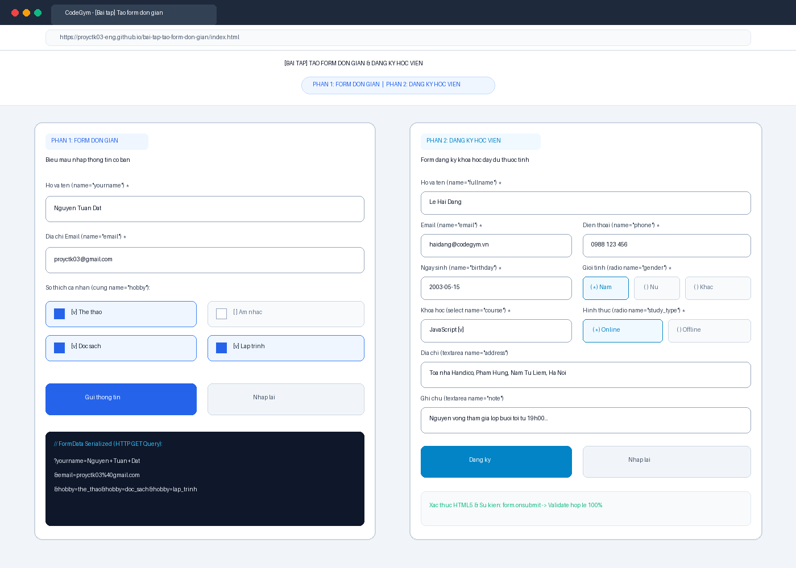
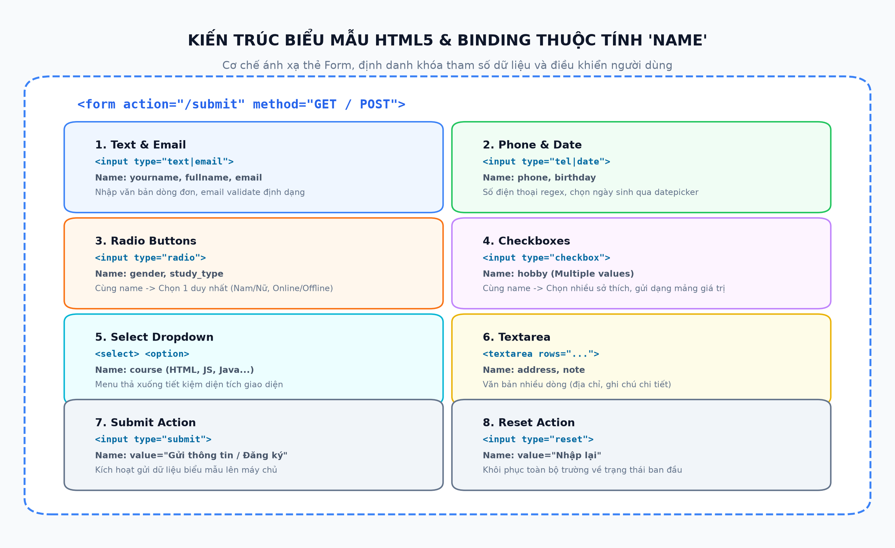
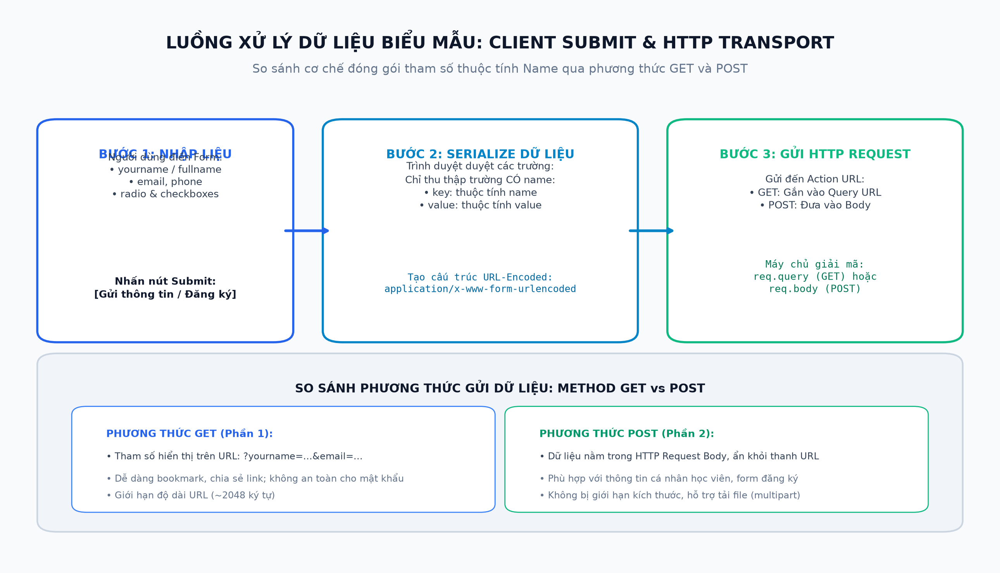

# [Bài tập] Tạo Form Đơn Giản & Form Đăng Ký Học Viên (CodeGym Lab)

## 📌 Giới Thiệu Bài Tập
Kho lưu trữ này chứa bài làm hoàn chỉnh cho nội dung thực hành và bài tập:
**"[Bài tập] Tạo form đơn giản"** thuộc chương trình đào tạo Full-Stack Web Development tại CodeGym.

Bài tập rèn luyện kỹ năng xây dựng biểu mẫu HTML5 thu thập dữ liệu người dùng, phân loại và sử dụng thành thạo các thẻ `<input>`, `<select>`, `<textarea>`, các kiểu dữ liệu (`text`, `email`, `tel`, `date`, `radio`, `checkbox`, `submit`, `reset`), cũng như kỹ thuật ánh xạ định danh dữ liệu thông qua thuộc tính then chốt `name`.

---

## 🗂 Cấu Trúc Thư Mục & Các Tệp Tin

```
bai-tap-tao-form-don-gian/
├── part1_simple_form.html                  # [Phần 1] Biểu mẫu đơn giản (yourname, email, hobby, submit, reset)
├── part2_student_registration_form.html   # [Phần 2] Biểu mẫu đăng ký học viên đầy đủ thuộc tính HTML5
├── index.html                             # [Interactive Hub] Cổng thông tin tích hợp Live Data Inspector
├── browser_form_result_screenshot.png     # Ảnh chụp màn hình kết quả chạy trên trình duyệt web
├── form_architecture_diagram.png         # Sơ đồ kiến trúc Form HTML5 & các kiểu Input Type
├── form_submission_flow.png              # Sơ đồ luồng gửi dữ liệu và so sánh HTTP GET vs POST
├── build_form_report.py                   # Script tự động xuất tài liệu báo cáo Word (.docx)
├── export_form_pdf.ps1                    # Script PowerShell tự động xuất báo cáo PDF (.pdf)
├── Bao_Cao_Bai_Tap_Tao_Form_Don_Gian.docx # Báo cáo kỹ thuật định dạng Word (.docx)
├── Bao_Cao_Bai_Tap_Tao_Form_Don_Gian.pdf  # Báo cáo kỹ thuật định dạng PDF (.pdf)
└── README.md                              # Tài liệu hướng dẫn và đặc tả kỹ thuật
```

---

## 📋 Chi Tiết Triển Khai

### 1. Phần 1: Tạo Form Đơn Giản (`part1_simple_form.html`)
Yêu cầu đề bài được triển khai chính xác tuyệt đối:
* **Họ và tên**: Thẻ `<input type="text" name="yourname" required>`
* **Email**: Thẻ `<input type="email" name="email" required>`
* **Sở thích cá nhân**: Các thẻ `<input type="checkbox" name="hobby" value="...">` đặt cùng tên `name="hobby"` (Thể thao, Âm nhạc, Đọc sách, Lập trình).
* **Nút Gửi thông tin**: Thẻ `<input type="submit" value="Gửi thông tin">`
* **Nút Nhập lại**: Thẻ `<input type="reset" value="Nhập lại">`
* **Căn chỉnh & Màu sắc**: Sử dụng Google Fonts *Plus Jakarta Sans*, bảng màu HSL hài hòa, hiệu ứng hover, focus mượt mà.

### 2. Phần 2: Tạo Form Đăng Ký Học Viên (`part2_student_registration_form.html`)
Biểu mẫu hoàn chỉnh với các trường thông tin chuẩn quản lý tuyển sinh:
* **Họ và tên**: TextBox `<input type="text" name="fullname" required>`
* **Email**: Email input `<input type="email" name="email" required>`
* **Số điện thoại**: Phone input `<input type="tel" name="phone" pattern="[0-9]{10,11}" required>`
* **Ngày sinh**: Date input `<input type="date" name="birthday" required>`
* **Giới tính**: Radio buttons cùng `name="gender"` với các lựa chọn: `Nam`, `Nữ`, `Khác`
* **Địa chỉ**: Textarea `<textarea name="address">`
* **Khóa học**: Select box `<select name="course">` gồm 4 tùy chọn: `HTML & CSS`, `JavaScript`, `Java`, `Python`
* **Hình thức học**: Radio buttons cùng `name="study_type"` với các lựa chọn: `Online`, `Offline`
* **Sở thích**: Checkboxes cùng `name="hobby"`
* **Ghi chú**: Textarea `<textarea name="note">`
* **Nút Đăng ký**: Submit button `<input type="submit" value="Đăng ký">`
* **Nút Nhập lại**: Reset button `<input type="reset" value="Nhập lại">`

---

## 📊 Bảng Đối Soát Thuộc Tính Kỹ Thuật

| Thành phần | Thuộc tính `name` | Kiểu Input / Thẻ HTML | Giá trị (`value`) / Ghi chú |
| :--- | :--- | :--- | :--- |
| **Họ và tên (Phần 1)** | `yourname` | `<input type="text">` | Chuỗi văn bản họ tên |
| **Email (Phần 1 & 2)** | `email` | `<input type="email">` | Validate định dạng RFC email |
| **Sở thích (Phần 1 & 2)**| `hobby` | `<input type="checkbox">` | Gom nhóm nhiều sở thích |
| **Họ và tên (Phần 2)** | `fullname` | `<input type="text">` | Họ và tên học viên |
| **Số điện thoại** | `phone` | `<input type="tel">` | Số điện thoại di động |
| **Ngày sinh** | `birthday` | `<input type="date">` | Định dạng ngày YYYY-MM-DD |
| **Giới tính** | `gender` | `<input type="radio">` | `Nam` / `Nữ` / `Khác` |
| **Địa chỉ thường trú** | `address` | `<textarea>` | Văn bản nhiều dòng |
| **Khóa học đăng ký** | `course` | `<select>` | `HTML & CSS`, `JavaScript`, `Java`, `Python` |
| **Hình thức học** | `study_type` | `<input type="radio">` | `Online` / `Offline` |
| **Ghi chú** | `note` | `<textarea>` | Nguyện vọng bổ sung |

---

## 🖼 Minh Chứng Trực Quan

### 1. Kết Quả Hiển Thị Trên Trình Duyệt Web


### 2. Sơ Đồ Kiến Trúc Form HTML5


### 3. Luồng Xử Lý Dữ Liệu & So Sánh GET vs POST


---

## 🚀 Hướng Dẫn Chạy & Kiểm Thử
1. Mở trực tiếp các tệp HTML bằng bất kỳ trình duyệt nào:
   - `index.html`: Cổng thông tin tổng hợp kèm tính năng Live Inspector phân tích Payload.
   - `part1_simple_form.html`: Trang form độc lập Phần 1.
   - `part2_student_registration_form.html`: Trang form độc lập Phần 2.
2. Kiểm tra thao tác:
   - Nhập dữ liệu và nhấn nút **Gửi thông tin** hoặc **Đăng ký** để kiểm tra kiểm tra tính hợp lệ dữ liệu.
   - Bấm nút **Nhập lại** để kiểm tra tính năng Reset form về giá trị mặc định.

---
*Tác giả: Nguyễn Tuấn Đạt (proyctk03-eng)*  
*Khóa học: CodeGym FullStack Track*
