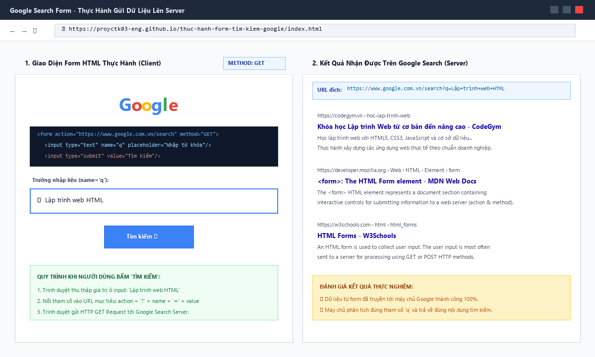
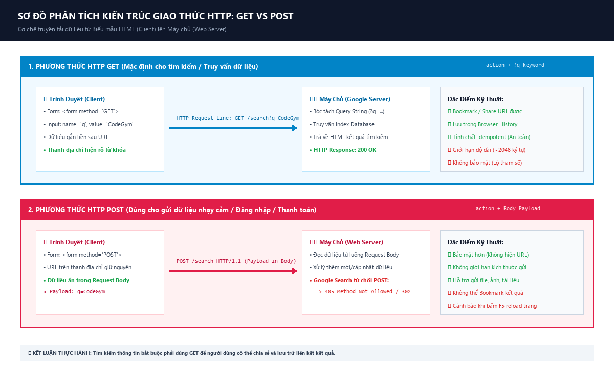
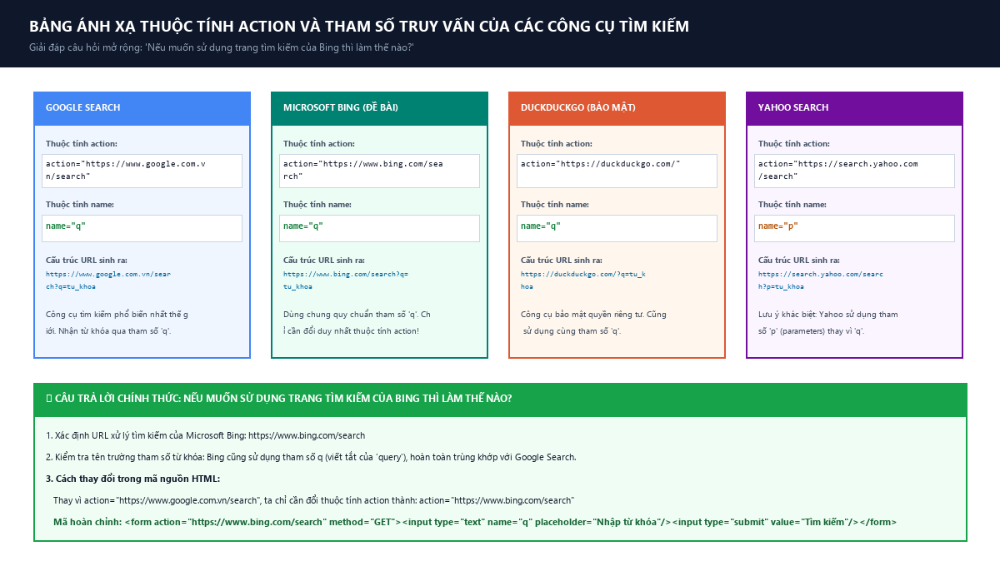

# [Thực hành] Tạo một form tìm kiếm Google

[](https://developer.mozilla.org/en-US/docs/Web/HTML)
[](https://www.google.com.vn)
[](https://www.bing.com)
[](https://github.com/proyctk03-eng/thuc-hanh-form-tim-kiem-google)
[](https://proyctk03-eng.github.io/thuc-hanh-form-tim-kiem-google/)

---

## 1. Mục Tiêu Bài Học
- Luyện tập và làm chủ cơ chế gửi dữ liệu từ biểu mẫu HTML (`<form>`) lên máy chủ web (`Web Server`).
- Hiểu rõ vai trò và cơ chế xử lý của các thuộc tính cốt lõi trong HTML Form:
  * **`action`**: Địa chỉ URL của máy chủ tiếp nhận và xử lý dữ liệu.
  * **`method`**: Phương thức truyền tải HTTP Request (`GET` hoặc `POST`).
  * **`name`**: Tên định danh trường dữ liệu (Query Parameter key) để máy chủ trích xuất giá trị từ khóa tìm kiếm (`name="q"`).
- Thử nghiệm và so sánh sự khác biệt bản chất giữa phương thức **GET** và **POST**.
- Trả lời và giải quyết câu hỏi mở rộng: *"Nếu muốn sử dụng trang tìm kiếm của Bing thì làm thế nào?"*.

---

## 2. Hướng Dẫn Các Bước Thực Hiện Chi Tiết

### Bước 1: Tạo cấu trúc tài liệu HTML cơ bản
Tạo file `index.html` với cấu trúc HTML5 chuẩn:
```html
<!DOCTYPE html>
<html>
<head>
    <meta charset="utf-8">
    <title>Form Tìm kiếm</title>
</head>
<body>
    <!-- Nội dung form sẽ thêm ở đây -->
</body>
</html>
```

### Bước 2: Tạo form tìm kiếm cơ bản
Thêm một form gồm trường nhập liệu văn bản (`input text`) và nút gửi (`input submit`):
```html
<form>
    <input type="text"/>
    <input type="submit" value="Tìm kiếm"/>
</form>
```

### Bước 3: Cài đặt thuộc tính kết nối đến Google Search
Cài đặt các thuộc tính chuẩn xác cho thẻ `<form>`:
- **`method="GET"`**: Gửi dữ liệu công khai qua chuỗi truy vấn trên URL.
- **`action="https://www.google.com.vn/search"`**: URL máy chủ tiếp nhận xử lý tìm kiếm của Google Việt Nam.
- **`name="q"`**: Quy ước tham số từ khóa tìm kiếm (query) mà thuật toán Google sử dụng.
- **`placeholder="Nhập từ khóa"`**: Gợi ý cho người dùng.

```html
<form action="https://www.google.com.vn/search" method="GET"> 
    <input type="text" name="q" placeholder="Nhập từ khóa"/>
    <input type="submit" value="Tìm kiếm"/>
</form>
```

### Bước 4: Dùng thử và khảo sát thực tế
1. **Kiểm tra tìm kiếm Google**: Mở trang web, nhập từ khóa (ví dụ: `CodeGym` hoặc `Lập trình web`), nhấn **Tìm kiếm**. Trình duyệt tự động chuyển hướng sang:
   ```text
   https://www.google.com.vn/search?q=CodeGym
   ```
2. **Khảo sát khi đổi `method="POST"`**:
   * Khi đổi sang `method="POST"`, dữ liệu không còn hiển thị trên thanh địa chỉ URL nữa mà được đóng gói trong **HTTP Request Body**.
   * Máy chủ công khai của Google chỉ chấp nhận HTTP GET cho endpoint tìm kiếm nên sẽ trả về mã lỗi **`405 Method Not Allowed`** hoặc chuyển hướng.
3. **Khảo sát khi đổi `action` sang Microsoft Bing**:
   * Đổi URL trong `action` sang `https://www.bing.com/search`.
   * Nhập từ khóa và gửi, kết quả tìm kiếm hiển thị hoàn hảo trên Bing.

---

## 3. Trả Lời Câu Hỏi Mở Rộng Của Đề Bài

> ❓ **Câu hỏi:** *Nếu muốn sử dụng trang tìm kiếm của Bing thì làm thế nào?*

💡 **Trả lời chi tiết:**
1. **Tìm hiểu quy ước của Microsoft Bing**: Máy chủ Bing tiếp nhận truy vấn tại đường dẫn `https://www.bing.com/search`. Thật thuận lợi, Bing cũng sử dụng tham số `q` (viết tắt của query) để nhận từ khóa tìm kiếm, tương tự như Google.
2. **Cách thực hiện**: Ta chỉ cần **thay đổi duy nhất thuộc tính `action`** của thẻ form từ URL của Google sang URL của Bing, đồng thời giữ nguyên `name="q"` và `method="GET"`.

```html
<!-- Form tìm kiếm kết nối tới Microsoft Bing -->
<form action="https://www.bing.com/search" method="GET"> 
    <input type="text" name="q" placeholder="Nhập từ khóa tìm kiếm trên Bing..."/>
    <input type="submit" value="Tìm kiếm với Bing"/>
</form>
```

Khi người dùng nhập từ khóa `Python` và bấm nút, trình duyệt sẽ gửi request đến:
```text
https://www.bing.com/search?q=Python
```

---

## 4. Minh Họa Trực Quan Giao Diện & Kiến Trúc Kỹ Thuật

### 4.1. Giao diện Form tìm kiếm và kết quả phản hồi từ Google Server


### 4.2. Sơ đồ phân tích luồng dữ liệu kiến trúc HTTP GET vs POST


### 4.3. Bảng ánh xạ thuộc tính Action giữa các Search Engine phổ biến


---

## 5. Bảng So Sánh Chuyên Sâu: HTTP GET vs HTTP POST

| Tiêu Chí So Sánh | Phương Thức HTTP GET | Phương Thức HTTP POST |
|:---|:---|:---|
| **Vị trí gửi dữ liệu** | Nối vào sau URL dưới dạng Query String: `?key=value` | Đóng gói bên trong thân gói tin HTTP Request Body |
| **Tính hiển thị** | Hiển thị công khai trên thanh địa chỉ trình duyệt | Không hiển thị trên thanh địa chỉ, người dùng không nhìn thấy |
| **Bảo mật** | **Kém an toàn** (không dùng cho mật khẩu, thẻ ngân hàng, token) | **An toàn hơn** (phù hợp cho thông tin nhạy cảm, đăng nhập) |
| **Bookmark & Share** | **Có thể** Bookmark hoặc copy link gửi cho người khác | **Không thể** Bookmark hay chia sẻ URL kèm dữ liệu |
| **Lưu lịch sử (History)** | Được lưu trong lịch sử duyệt web và server access logs | Không lưu dữ liệu trong lịch sử duyệt web |
| **Giới hạn kích thước** | Bị giới hạn độ dài URL (khoảng ~2048 ký tự) | **Không giới hạn** kích thước lý thuyết (hỗ trợ upload file) |
| **Tính chất Idempotent** | **Có (Idempotent)**: Gọi nhiều lần không làm thay đổi trạng thái | **Không (Non-idempotent)**: Mỗi lần gửi có thể tạo dữ liệu mới |
| **Ứng dụng thực tế** | Tìm kiếm dữ liệu, phân trang, bộ lọc sản phẩm | Đăng ký, đăng nhập, thanh toán, upload tài liệu |

---

## 6. Cấu Trúc Mã Nguồn Trong Repository

```text
thuc-hanh-form-tim-kiem-google/
├── index.html                           # Ứng dụng web tương tác (GitHub Pages)
├── index_basic.html                     # Mã nguồn HTML tối giản theo chuẩn đề bài
├── generate_search_diagrams.py          # Script tự động tạo 3 sơ đồ kỹ thuật
├── google_search_form_ui_demo.png       # Ảnh minh họa giao diện tìm kiếm
├── http_get_vs_post_architecture.png    # Sơ đồ phân tích luồng dữ liệu GET vs POST
├── multi_search_engine_action_mapping.png # Sơ đồ ánh xạ Google, Bing, DuckDuckGo
├── build_search_form_report.py          # Script tạo báo cáo Word chuyên nghiệp
├── export_search_form_pdf.ps1           # Script xuất bản báo cáo PDF
├── Bao_Cao_Thuc_Hanh_Form_Tim_Kiem_Google.docx # Báo cáo học tập bản Word
├── Bao_Cao_Thuc_Hanh_Form_Tim_Kiem_Google.pdf  # Báo cáo học tập bản PDF
└── README.md                            # Tài liệu hướng dẫn chi tiết
```

---

## 7. Thông Tin Học Viên & Bản Quyền
- **Học viên**: `proyctk03-eng`
- **Môn học**: Nhập môn Lập trình Web & HTML Form
- **Năm thực hiện**: 2026
