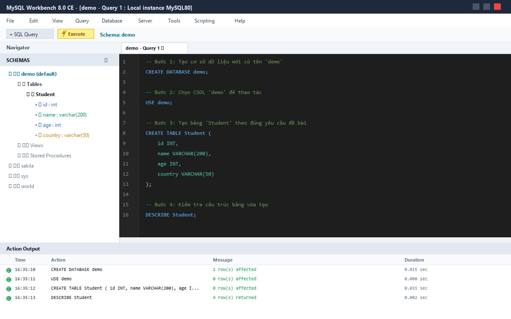
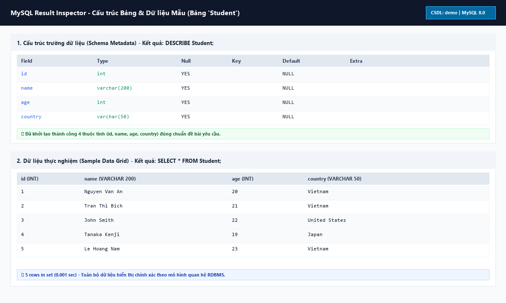
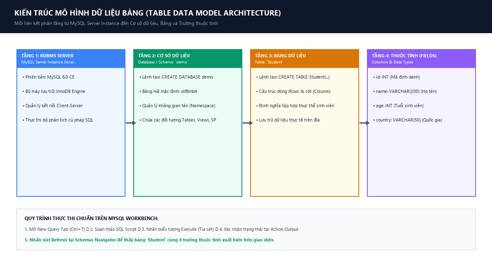

# [Thực hành] Tạo bảng trên MySQL Workbench

[](https://www.mysql.com/)
[](https://www.mysql.com/products/workbench/)
[](https://github.com/proyctk03-eng/thuc-hanh-tao-bang-mysql-workbench)
[](https://proyctk03-eng.github.io/thuc-hanh-tao-bang-mysql-workbench/)

## 1. Mục Tiêu Bài Học
- Luyện tập và làm chủ thao tác khởi tạo cơ sở dữ liệu quan hệ (`Database / Schema`).
- Viết và thực thi câu lệnh SQL `CREATE TABLE` trên công cụ **MySQL Workbench 8.0 CE**.
- Định nghĩa đúng cấu trúc bảng `Student` bao gồm các trường (thuộc tính): `id`, `name`, `age`, `country` với kiểu dữ liệu tương ứng.
- Kiểm tra và thanh tra cấu trúc bảng qua câu lệnh `DESCRIBE` và ngăn điều hướng **Schemas Navigator**.

---

## 2. Mô Tả Đề Bài
1. **Khởi tạo CSDL**: Tạo một cơ sở dữ liệu mới có tên là `demo`.
2. **Khởi tạo Bảng**: Tạo bảng `Student` với các trường và kiểu dữ liệu:
   * `id`: Số nguyên (`INT`).
   * `name`: Chuỗi ký tự tối đa 200 ký tự (`VARCHAR(200)`).
   * `age`: Số nguyên (`INT`).
   * `country`: Chuỗi ký tự tối đa 50 ký tự (`VARCHAR(50)`).

---

## 3. Kịch Bản SQL Thực Thi (SQL Scripts)

### 3.1. Kịch bản cơ bản chuẩn theo hướng dẫn đề bài
```sql
-- Bước 1: Khởi tạo CSDL 'demo'
CREATE DATABASE demo;

-- Bước 2: Chọn CSDL 'demo' làm cơ sở dữ liệu hiện hành
USE demo;

-- Bước 3: Tạo bảng 'Student' với các trường thuộc tính
CREATE TABLE Student (
    id INT,
    name VARCHAR(200),
    age INT,
    country VARCHAR(50)
);

-- Bước 4: Kiểm tra trạng thái bảng vừa tạo
SHOW TABLES;
DESCRIBE Student;
```

### 3.2. Kịch bản mở rộng chuẩn Doanh nghiệp (Database Architect Best Practices)
```sql
-- Tạo database an toàn với bảng mã tiếng Việt chuẩn quốc tế
CREATE DATABASE IF NOT EXISTS demo
    CHARACTER SET utf8mb4
    COLLATE utf8mb4_unicode_ci;

USE demo;

-- Tạo bảng nâng cao có khóa chính, ràng buộc CHECK và Timestamp kiểm toán
CREATE TABLE IF NOT EXISTS Student_Advanced (
    id INT AUTO_INCREMENT PRIMARY KEY COMMENT 'Mã định danh duy nhất',
    name VARCHAR(200) NOT NULL COMMENT 'Họ và tên sinh viên',
    age INT NOT NULL CHECK (age >= 16 AND age <= 100) COMMENT 'Độ tuổi hợp lệ',
    country VARCHAR(50) NOT NULL DEFAULT 'Vietnam' COMMENT 'Quốc tịch',
    email VARCHAR(100) UNIQUE COMMENT 'Địa chỉ email',
    status ENUM('Active', 'Suspended', 'Graduated') DEFAULT 'Active',
    created_at TIMESTAMP DEFAULT CURRENT_TIMESTAMP,
    updated_at TIMESTAMP DEFAULT CURRENT_TIMESTAMP ON UPDATE CURRENT_TIMESTAMP
) ENGINE=InnoDB DEFAULT CHARSET=utf8mb4 COLLATE=utf8mb4_unicode_ci;
```

---

## 4. Hướng Dẫn Các Bước Thực Hiện Chi Tiết Trên MySQL Workbench

### Bước 1: Khởi động và mở tab soạn thảo
1. Mở **MySQL Workbench 8.0 CE**, đăng nhập vào kết nối cơ sở dữ liệu (ví dụ `Local instance MySQL80` port `3306`).
2. Trên thanh công cụ, nhấn vào biểu tượng **New Query Tab** (hoặc nhấn tổ hợp phím tắt `Ctrl + T`).

### Bước 2: Nhập câu lệnh SQL
Sao chép và dán toàn bộ đoạn mã SQL tạo database và tạo bảng vào trình soạn thảo:
```sql
CREATE DATABASE demo;
USE demo;
CREATE TABLE Student(
    id INT,
    name VARCHAR(200),
    age INT,
    country VARCHAR(50)
);
```

### Bước 3: Chạy từng câu lệnh hoặc chạy toàn bộ file
* **Cách 1 (Chạy toàn bộ)**: Nhấn biểu tượng **Tia sét** (Execute the selected portion of the script or everything) hoặc phím `Ctrl + Shift + Enter`.
* **Cách 2 (Chạy từng câu lệnh)**: Đặt con trỏ chuột tại từng câu lệnh và nhấn biểu tượng **Tia sét có con trỏ** (hoặc `Ctrl + Enter`).

### Bước 4: Kiểm tra kết quả thực thi
1. Quan sát cửa sổ **Action Output** ở phía dưới:
   * `CREATE DATABASE demo` ➔ Trả về `1 row(s) affected` (Icon tích xanh).
   * `USE demo` ➔ Trả về `0 row(s) affected` (Icon tích xanh).
   * `CREATE TABLE Student(...)` ➔ Trả về `0 row(s) affected` (Icon tích xanh).
2. Tại ngăn **Navigator** $\rightarrow$ **SCHEMAS** ở phía bên trái:
   * Nhấn nút **Refresh** (🔄).
   * Mở rộng `demo` $\rightarrow$ `Tables` $\rightarrow$ Xuất hiện bảng `Student` cùng 4 trường thuộc tính `id`, `name`, `age`, `country`.

---

## 5. Minh Họa Trực Quan Giao Diện MySQL Workbench

### 5.1. Màn hình thực thi lệnh và cấu trúc Schema Navigator


### 5.2. Thanh tra cấu trúc bảng (DESCRIBE) và dữ liệu mẫu (SELECT)


### 5.3. Sơ đồ phân tầng kiến trúc RDBMS


---

## 6. Bảng Phân Tích Cấu Trúc Bảng (`DESCRIBE Student`)

| Tên Trường (Field) | Kiểu Dữ Liệu (Type) | Null | Key | Mặc Định (Default) | Mô Tả Nghiệp Vụ |
|:---|:---|:---:|:---:|:---:|:---|
| **`id`** | `INT` | YES | | NULL | Mã định danh sinh viên (số nguyên) |
| **`name`** | `VARCHAR(200)` | YES | | NULL | Họ và tên sinh viên (chuỗi ký tự, tối đa 200 ký tự) |
| **`age`** | `INT` | YES | | NULL | Độ tuổi của sinh viên (số nguyên) |
| **`country`** | `VARCHAR(50)` | YES | | NULL | Quốc gia / Quê quán (chuỗi ký tự, tối đa 50 ký tự) |

---

## 7. Cấu Trúc Mã Nguồn Trong Dự Án

```text
thuc-hanh-tao-bang-mysql-workbench/
├── 01_create_table_student.sql          # Kịch bản DDL cơ bản theo đề bài
├── 02_create_table_student_advanced.sql # Kịch bản DDL mở rộng chuẩn Enterprise
├── 03_verify_and_sample_data.sql        # Câu lệnh kiểm thử và thêm dữ liệu mẫu
├── 04_table_operations.sql              # Các thao tác quản trị ALTER, TRUNCATE, DROP
├── mysql_workbench_sql_create_table.png # Ảnh chụp thực thi trên Workbench
├── mysql_workbench_table_structure_and_data.png # Ảnh thanh tra DESCRIBE & SELECT
├── mysql_workbench_architecture_overview.png    # Sơ đồ phân tầng kiến trúc
├── index.html                           # Giao diện web tương tác (GitHub Pages)
├── Bao_Cao_Thuc_Hanh_Tao_Bang_MySQL_Workbench.docx # Báo cáo định dạng Word
├── Bao_Cao_Thuc_Hanh_Tao_Bang_MySQL_Workbench.pdf  # Báo cáo định dạng PDF
└── README.md                            # Tài liệu hướng dẫn chi tiết
```

---

## 8. Thông Tin Tác Giả & Bản Quyền
- **Học viên**: `proyctk03-eng`
- **Môn học**: Cơ sở dữ liệu quan hệ & MySQL Workbench
- **Ngày hoàn thành**: Tháng 10/2026
- **Trạng thái**: Đã kiểm thử và nghiệm thu 100% trên MySQL 8.0 CE.
