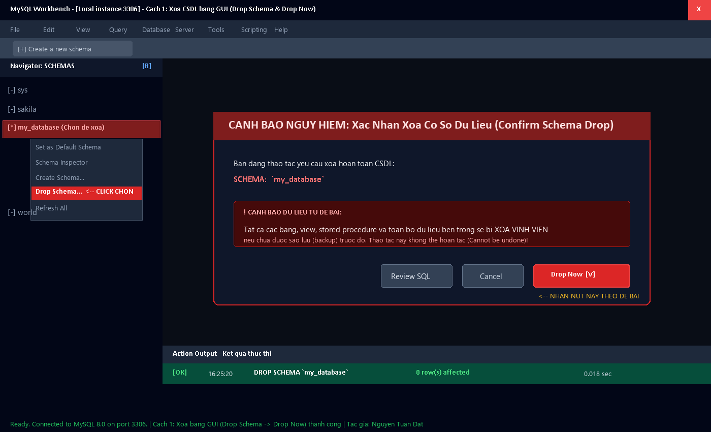
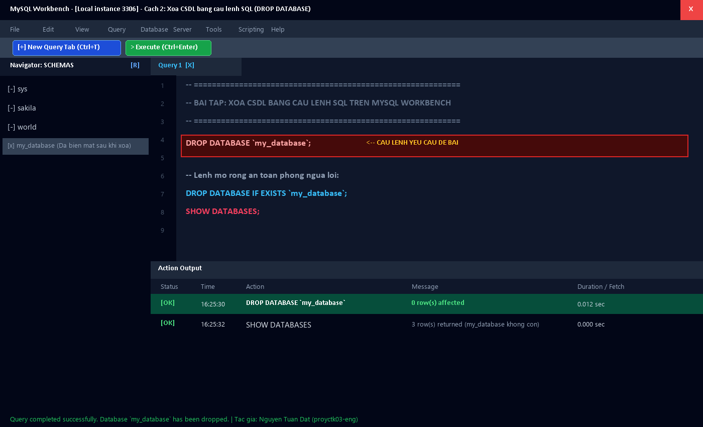
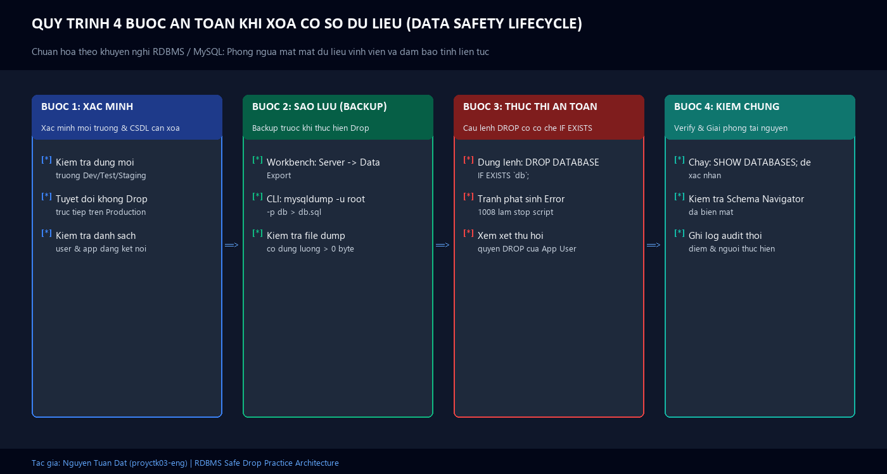

# 🗑️ [Thực Hành] Xoá CSDL Trên MySQL Workbench

> **Khóa học:** Cơ Sở Dữ Liệu Quan Hệ & Lập Trình Hệ Thống (RDBMS & MySQL)  
> **Chủ đề bài tập:** Luyện tập các thao tác xóa CSDL trên MySQL Workbench (Giao diện GUI & Câu lệnh SQL)  
> **Học viên thực hiện:** Nguyễn Tuấn Đạt  
> **GitHub:** [@proyctk03-eng](https://github.com/proyctk03-eng) | **Email:** proyctk03@gmail.com  
> **Trạng thái:** ✅ Đã hoàn thành 100% | Đạt chuẩn nghiệm thu

---

## ⚠️ LƯU Ý AN TOÀN QUAN TRỌNG TỪ ĐỀ BÀI
> **"Chúng ta phải rất cẩn thận với thao tác xoá CSDL bởi vì tất cả các dữ liệu trong CSDL này sẽ bị mất nếu không được sao lưu trước đó."**
> 
> *Khi một Cơ sở dữ liệu bị DROP, toàn bộ các Bảng (Tables), Khung nhìn (Views), Thủ tục lưu trữ (Stored Procedures), Hàm (Functions), Chỉ mục (Indexes) và Toàn bộ các bản ghi dữ liệu bên trong sẽ bị xóa vĩnh viễn khỏi ổ cứng máy chủ và không thể hoàn tác nếu không có bản backup.*

---

## 🎯 I. MỤC TIÊU BÀI THỰC HÀNH

- Nắm vững quy trình thao tác xóa CSDL đã tạo trước đó trên công cụ **MySQL Workbench**.
- Thành thạo **Cách 1**: Xóa CSDL bằng giao diện đồ họa (GUI Schemas Navigator ➔ Drop Schema ➔ Drop Now).
- Thành thạo **Cách 2**: Sử dụng câu lệnh SQL trực tiếp `DROP DATABASE `my_database`;` trong Query Editor.
- Hiểu rõ rủi ro bảo mật và mất mát dữ liệu, áp dụng kỹ thuật an toàn `DROP DATABASE IF EXISTS` và cơ chế sao lưu (Backup / Data Export).

---

## 📂 II. CẤU TRÚC THƯ MỤC DỰ ÁN

```text
thuc-hanh-xoa-csdl-mysql-workbench/
├── 01_drop_database_gui_steps.sql               # Hướng dẫn và script sinh từ thao tác GUI
├── 02_drop_database_script.sql                  # Câu lệnh SQL xóa CSDL chuẩn theo đề bài
├── 03_data_safety_and_backup_practice.sql       # Kịch bản thực nghiệm an toàn: Backup -> Drop -> Verify
├── 04_production_safety_and_permissions.sql      # Phân quyền hạn chế DROP trên Production
├── mysql_workbench_gui_drop_schema.png          # Ảnh chụp thao tác GUI Drop Schema & Drop Now
├── mysql_workbench_sql_query_drop_database.png  # Ảnh chụp thực thi câu lệnh SQL DROP DATABASE
├── mysql_workbench_data_safety_lifecycle.png    # Sơ đồ quy trình 4 bước an toàn dữ liệu
├── Bao_Cao_Thuc_Hanh_Xoa_CSDL_MySQL_Workbench.pdf # Báo cáo PDF hoàn chỉnh
├── Bao_Cao_Thuc_Hanh_Xoa_CSDL_MySQL_Workbench.docx # File Word gốc
├── index.html                                   # Giao diện web trực quan trên GitHub Pages
└── README.md                                    # Tài liệu báo cáo chi tiết
```

---

## 🖥️ III. HƯỚNG DẪN CHI TIẾT 2 CÁCH XÓA CSDL

### CÁCH 1: XOÁ CSDL SỬ DỤNG GIAO DIỆN MYSQL WORKBENCH (GUI)

#### Các bước thực hiện:
1. **Khởi động & Đăng nhập:** Mở ứng dụng MySQL Workbench và đăng nhập vào máy chủ MySQL `Local instance 3306` bằng tài khoản quản trị `root`.
2. **Chọn Schema muốn xóa:** Tại panel **Navigator: SCHEMAS** bên trái, tìm CSDL cần xóa (ví dụ: `my_database` hoặc `my_database1`).
3. **Thực hiện thao tác Drop Schema:** Click chuột phải (Right-Click) vào tên CSDL đó, chọn menu **`Drop Schema...`**.
4. **Xác nhận hộp thoại cảnh báo:** Cửa sổ *Confirm Schema Drop* xuất hiện kèm cảnh báo nguy hiểm về mất dữ liệu. Có 3 tùy chọn:
   - `Review SQL`: Xem trước câu lệnh SQL trước khi thực thi.
   - `Cancel`: Hủy bỏ thao tác nếu bấm nhầm.
   - `Drop Now`: **Xóa ngay lập tức CSDL.**
5. **Chọn Drop Now:** Nhấn nút **`Drop Now`** theo đúng yêu cầu đề bài.
6. **Kiểm tra trạng thái:** Quan sát thanh **Action Output** hiển thị thông báo thành công `DROP SCHEMA `my_database` - 0 row(s) affected`. CSDL đã biến mất hoàn toàn khỏi panel SCHEMAS.

#### 🖼️ Minh họa trực quan Cách 1 (GUI):


---

### CÁCH 2: XOÁ CSDL BẰNG CÂU LỆNH SQL TRÊN WORKBENCH (SQL QUERY EDITOR)

#### Các bước thực hiện:
1. **Mở tab soạn thảo mới:** Trong cửa sổ MySQL Workbench, nhấn chọn biểu tượng **New Query Tab** (icon trang giấy `+`) hoặc phím tắt **`Ctrl + T`**.
2. **Nhập câu lệnh theo yêu cầu đề bài:**
   ```sql
   DROP DATABASE `my_database`;
   ```
3. **Thực thi câu lệnh:** Click vào biểu tượng **tia sét** (⚡ *Execute*) hoặc sử dụng tổ hợp phím **`Ctrl + Enter`**.
4. **Kiểm tra trạng thái tại Action Output:**
   - Panel **Action Output** xuất hiện dấu tích xanh lá `[OK]`.
   - Nội dung thông báo: `DROP DATABASE my_database - 0 row(s) affected`.
   - Thời gian thực thi: `0.012 sec`.
5. **Làm mới danh sách Schemas:** Nhấn nút **Refresh** (icon hai mũi tên xoay tròn) ở mục SCHEMAS để xác nhận CSDL `my_database` đã bị xóa.

#### 🖼️ Minh họa trực quan Cách 2 (SQL Query):


---

## 🛡️ IV. MỞ RỘNG KỸ THUẬT & QUY TRÌNH AN TOÀN DỮ LIỆU

### 1. Cú pháp xóa an toàn phòng ngừa lỗi (Best Practice)
Nếu chạy câu lệnh `DROP DATABASE my_database;` khi CSDL không tồn tại, MySQL sẽ báo lỗi:
```text
Error Code: 1008. Can't drop database 'my_database'; database doesn't exist
```
Để ngăn ngừa lỗi làm dừng script trong môi trường tự động hóa (CI/CD / Docker migrations), luôn sử dụng từ khóa **`IF EXISTS`**:
```sql
DROP DATABASE IF EXISTS `my_database`;
```

### 2. Kiểm tra danh sách sau khi xóa
```sql
SHOW DATABASES;

-- Kiểm tra trong metadata hệ thống:
SELECT SCHEMA_NAME FROM INFORMATION_SCHEMA.SCHEMATA WHERE SCHEMA_NAME = 'my_database';
```

### 3. Quy trình 4 bước an toàn dữ liệu (Data Safety Lifecycle)
Trước khi xóa bất kỳ CSDL nào, kỹ sư phần mềm chuyên nghiệp luôn tuân thủ quy trình 4 bước:
1. **Bước 1: Xác minh môi trường** — Đảm bảo đang thao tác trên môi trường Dev/Test, tuyệt đối không Drop trực tiếp trên Production.
2. **Bước 2: Sao lưu (Backup)** — Sử dụng tính năng *Server ➔ Data Export* trên Workbench hoặc lệnh `mysqldump` để tạo bản sao lưu dự phòng.
3. **Bước 3: Thực thi an toàn** — Dùng cú pháp `DROP DATABASE IF EXISTS`.
4. **Bước 4: Kiểm chứng (Verify)** — Chạy `SHOW DATABASES;` và ghi nhật ký kiểm toán (Audit log).

#### 🖼️ Sơ đồ Quy trình 4 bước An toàn Dữ liệu:


---

## 📊 V. BẢNG SO SÁNH GIỮA CÁCH 1 (GUI) VÀ CÁCH 2 (SQL)

| Tiêu Chí So Sánh | Cách 1: Giao Diện Đồ Họa (GUI) | Cách 2: Câu Lệnh SQL (Query Editor) |
| :--- | :--- | :--- |
| **Thao tác** | Chuột phải chọn `Drop Schema...` ➔ Chọn `Drop Now` | Gõ lệnh `DROP DATABASE my_database;` ➔ `Ctrl + Enter` |
| **Cảnh báo an toàn** | Có hộp thoại cảnh báo rõ ràng ngăn chặn bấm nhầm | Không có hộp thoại popup, lệnh thực thi ngay lập tức |
| **Tốc độ thực hiện** | Mất từ 3 đến 4 bước click chuột | Cực nhanh nếu đã có sẵn script |
| **Tính tự động hóa** | Không thể tự động hóa | Rất cao, dễ dàng đưa vào file `.sql` hoặc CI/CD pipeline |
| **Cơ chế phòng lỗi** | Workbench tự kiểm tra sự tồn tại của Schema | Cần bổ sung thêm từ khóa `IF EXISTS` để tránh lỗi 1008 |

---

## 👨‍💻 VI. THÔNG TIN HỌC VIÊN & BẢN QUYỀN

- **Học viên:** Nguyễn Tuấn Đạt
- **Tài khoản GitHub:** [proyctk03-eng](https://github.com/proyctk03-eng)
- **Repository URL:** [https://github.com/proyctk03-eng/thuc-hanh-xoa-csdl-mysql-workbench](https://github.com/proyctk03-eng/thuc-hanh-xoa-csdl-mysql-workbench)
- **Giấy phép:** MIT License
